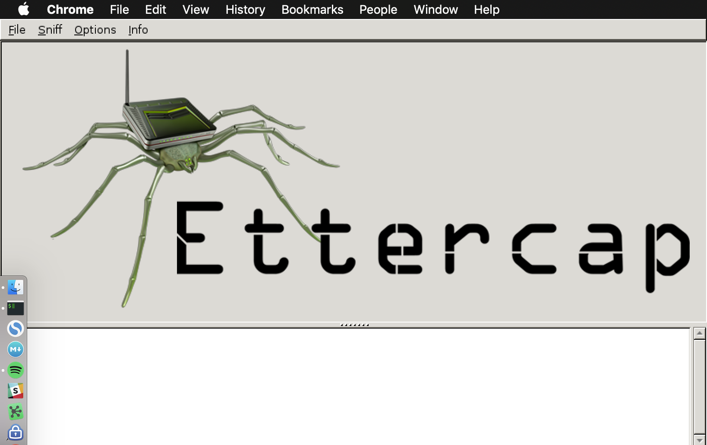

ettercap graphical in docker
============================

This project builds and runs ettercap-graphical in Docker, designed for use on OSX.



build
-----

```bash
docker build -t=pemcconnell/ettercap-graphical:latest .
```

run (OSX. XQuartz)
------------------

**dependencies**

 - socat
 - XQuartz (tested on 2.7.11)
 - Docker (tested on 18.09.0)

```bash
# run this in a separate window
socat TCP-LISTEN:6000,reuseaddr,fork UNIX-CLIENT:\"$DISPLAY\"

export IP=$(ifconfig en0 | grep inet | awk '$1=="inet" {print $2}')

docker run \
  --rm \
  -e "DISPLAY=$IP:0" \
  -ti \
  pemcconnell/ettercap-graphical:latest
```
